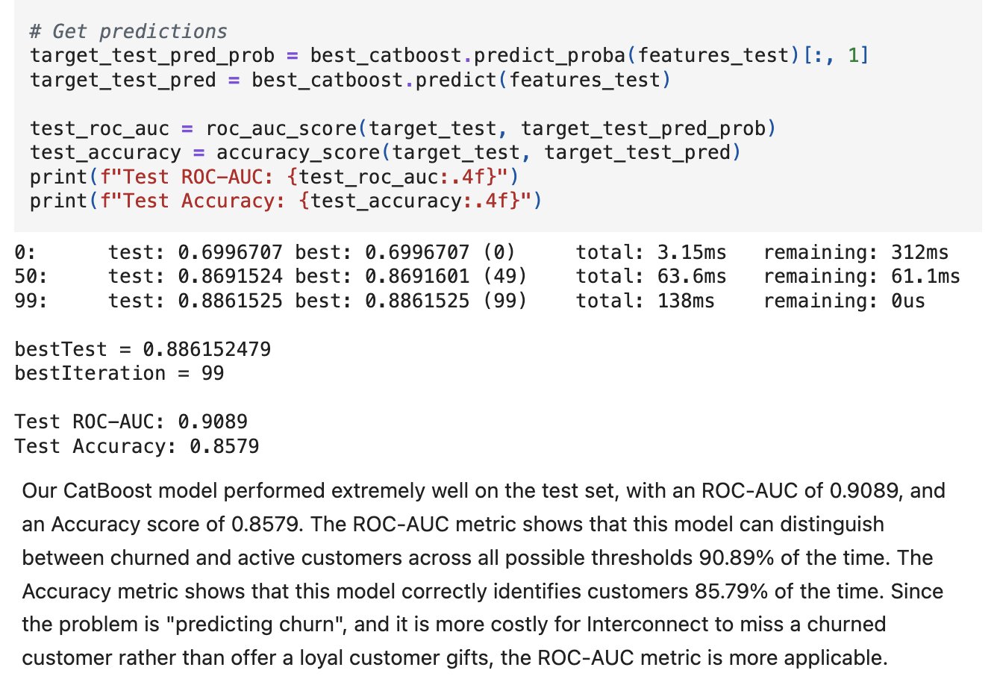

# Hi there, I'm Christopher Asher!

## About Me

I'm a passionate **Data Scientist** with experience in **Python, SQL, and Machine Learning**. I love tackling complex problems, learning new skills, and collaborating with diverse teams to create innovative solutions.

- Currently learning: ****
- Working on: **Dungeons and Dragons Monster Edition Converter**
- Languages: **English, Python, SQL**
- How to reach me: **asherchristoph@gmail.com**
- Fun fact: **Proud left-hander**

## My Skills

## Featured Projects

### [Computer Vision](asherchristoph/Data_projects_TriplTen/ComputerVisionProject.ipynb)

**Computer Vision Project** is an **age verification model** built with the **Tensorflow ResNet50 framework**. This project demonstrates my ability to **generate a script containing a concise, highly functioning model**. You can check out the repository [here](asherchristoph/Data_projects_TripleTen/ComputerVisionProject.ipynb).

### [Final Project](asherchristoph/Data_projects_TripleTen/FinalProject_Interconnect.ipynb)

**Final Project Interconnect** is a **churn-identification model for telecom operator Interconnect** built with **CatBoost model**. This project showcases my skills in **exploratory data analysis, database joining and splitting, model selection and hyperparameter tuning** to achieve the highest possible score within a reasonable timeframe. You can check out the repository [here](asherchristoph/Data_projects_TripleTen/FinalProject_Interconnect.ipynb).

## Get in Touch 📬

- **[LinkedIn]**(www.linkedin.com/in/asherchristopher)
