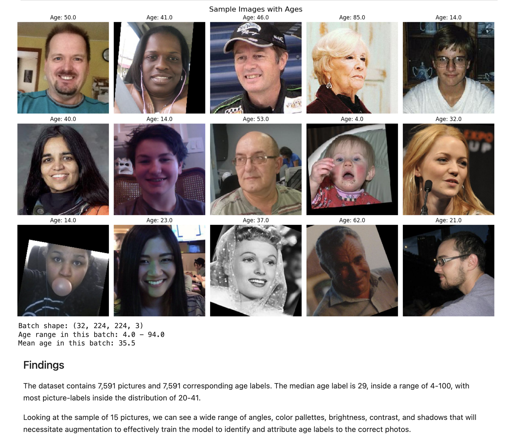

# Hi there, I'm Christopher Asher!

## About Me

I'm a passionate **Data Scientist** with experience in **Python, SQL, and Machine Learning**. I love tackling complex problems, learning new skills, and collaborating with diverse teams to create innovative solutions.

- Currently learning: ****
- Working on: **Dungeons and Dragons Monster Edition Converter**
- Languages: **English, Python, SQL**
- How to reach me: **asherchristoph@gmail.com**
- Fun fact: **Proud left-hander**

## My Skills

## Featured Projects

### [Computer Vision](https://github.com/asherchristoph/Data_projects_TripleTen/blob/main/ComputerVisionProject.ipynb)

**Computer Vision Project** is a  built with **[technologies used]**. This project demonstrates my ability to **[skills demonstrated by the project]**. You can check out the repository [here](project_1_repository_link).

### [Final Project](project_2_link)

**[Project 2 Title]** is a **[brief project description]** built with **[technologies used]**. This project showcases my skills in **[skills demonstrated by the project]**. You can check out the repository [here](project_2_repository_link).

## Get in Touch 📬

- **[Personal Website / Blog]**(your_website_or_blog_link)
- **[LinkedIn]**(your_linkedin_profile_link)
- **[Twitter]**(your_twitter_profile_link)
